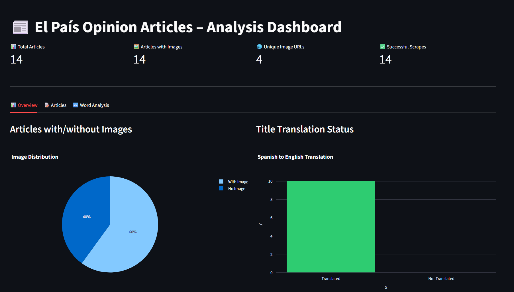
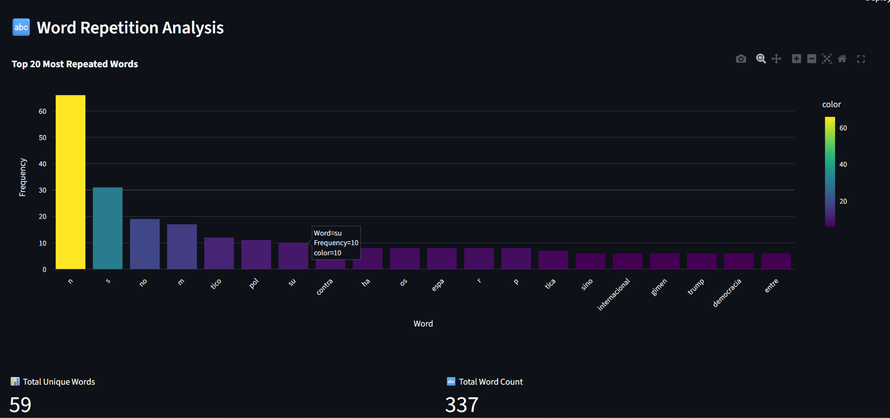

# El País Opinion – Selenium Scraper & Streamlit Dashboard

End–to–end system that scrapes El País Opinion articles with Selenium, analyzes text, visualizes insights in a Streamlit dashboard, and sends failure alerts via AWS SNS. Also includes cross–browser smoke tests on BrowserStack.

## 🔍 What this project does

- Scrapes the **Opinion** section of [elpais.com](https://elpais.com) (editoriales, tribunas).
- Extracts article titles, bodies, and lead images.
- Runs **text analysis** (word frequencies, repeated words in titles).
- Serves an interactive **Streamlit dashboard** on top of the scraped CSV.
- Sends **email alerts** via SNS when the pipeline fails, with a `FORCE_FAILURE` flag to demo the failure path.
- Runs **parallel smoke tests on BrowserStack** across multiple browsers/devices.

## 🧱 Tech stack

- **Python**, **Selenium**
- **Streamlit**, **Plotly**, **Pandas**
- **AWS SNS**, **boto3**, **python‑dotenv**
- **BrowserStack** (Remote WebDriver via `webdriver-manager`)

## 📂 Project structure

```text
selenium_automation_system/
  config.py             # BASE_URL, ARTICLE_LIMIT, FORCE_FAILURE, paths, etc.
  main.py               # Entrypoint that calls run_pipeline()

  dashboard.py          # Streamlit dashboard (reads reports/results.csv)

  pages/
    home_page.py        # El País homepage (open + cookies + nav)
    opinion_page.py     # Opinion listing page (collect article links)
    article_page.py     # Article details (title, body, image URL)

  utils/
    driver_setup.py     # Local Chrome + BrowserStack driver helpers
    logger.py           # Simple file logger to reports/logs.log
    notifications.py    # AWS SNS failure notifications
    text_analysis.py    # Word frequency + repeated title words
    translation_api.py  # Title translation (Spanish → English)
    images_downloader.py# Parallel image downloads (to images/)

  tests/
    test_local_flow.py  # Local pipeline runner + (optional) tests
    browserstack_runner.py  # BrowserStack smoke tests

  reports/              # CSV + logs output (gitignored)
  images/               # Downloaded article images (gitignored)
  docs/                 # README screenshots (dashboard_overview.png, etc.)

  requirements.txt
  README.md
  .gitignore
  .env                  # SNS + BrowserStack secrets (gitignored)
           
⚙️ Setup
 Clone the repo

```bash
git clone https://github.com/its-Adarsh2003/selenium_automation_system.git
cd selenium_automation_system
Create and activate virtualenv

```bash
python -m venv .venv
# Windows
.venv\Scripts\activate
# macOS / Linux
source .venv/bin/activate
Install dependencies

```bash
pip install -r requirements.txt
Environment variables (.env)

Create a .env file in the project root:

```markdown
```text
SNS_TOPIC_ARN=arn:aws:sns:us-east-1:XXXXXXXXXXXX:YOUR_TOPIC
AWS_REGION=us-east-1

BROWSERSTACK_USERNAME=your_browserstack_username
BROWSERSTACK_ACCESS_KEY=your_browserstack_access_key
.env is gitignored. The project uses python-dotenv to load it at runtime.

🕸️ Running the scraper pipeline
The main scraping pipeline lives in tests/test_local_flow.py via run_pipeline() (or directly in local_flow.py depending on how you structure it).

Typical usage:

```bash
python main.py
This will:

Open El País Opinion in a real browser (local Chrome via Selenium).

Collect the first ARTICLE_LIMIT articles from the listing.

Visit each article, extract:

Spanish title

English title (via translate_to_english)

Article body

Lead image URL and downloaded image path

Compute word frequencies using text_analysis.analyze_words.

Append rows to reports/results.csv and log events to reports/logs.log.

Failure alerts (AWS SNS)
In config.py:

python
FORCE_FAILURE = False  # normal mode
When I want to demo alerting, I flip it to:

python
FORCE_FAILURE = True
At the top of run_pipeline():

python
from config import FORCE_FAILURE
from utils.notifications import notify_failure

def run_pipeline():
    if FORCE_FAILURE:
        msg = "Forced failure triggered from config.FORCE_FAILURE"
        log(msg)
        notify_failure(msg)
        raise RuntimeError(msg)
    ...
utils/notifications.py loads .env, builds an SNS client with boto3, and publishes a message to the configured topic. This sends an email to any confirmed subscribers on that topic.

📊 Streamlit dashboard
The dashboard is built in dashboard.py on top of reports/results.csv:

```bash
streamlit run dashboard.py
Key components:

Metrics row:

Total articles

Articles with images

Unique image URLs

Successful scrapes

Overview tab:

Pie chart: articles with vs without images.

Bar chart: translated vs non‑translated titles.

Articles tab:

Table with article URL, Spanish title, English title, image URL.

Word Analysis tab:

Parses word_counts_list stored as a stringified list of (word, count) tuples.

Aggregates counts across selected articles and drops common stopwords.

Shows a bar chart of the top‑N most frequent words.

Example:
python
def parse_word_counts_list(raw: str) -> dict:
    if not isinstance(raw, str):
        return {}
    raw = raw.strip()
    if not raw:
        return {}

    data = ast.literal_eval(raw)
    word_dict = {}
    for word, count in data:
        word_dict[str(word)] = word_dict.get(str(word), 0) + int(count)
    return word_dict

🌐 BrowserStack smoke tests
To validate that the basic navigation works across multiple environments, there is a BrowserStack runner (using utils.driver_setup.get_bs_driver).

Desktop:

Chrome on Windows 11

Edge on Windows 10

Safari on macOS Sonoma

Mobile:

Chrome on Samsung Galaxy S23

Safari on iPhone 15

Example usage:

```bash
python tests/browserstack_runner.py
The script:

Creates parallel Remote WebDriver sessions with different capabilities.
solve krta hu abhi e=acche se detail m bta

Navigates: homepage → accept cookies → opinion page.

Logs success/failure for each capability and total runtime.

##🖼️ Screenshots
```
### Dashboard overview


### Word analysis

```
🧪 Notes for reviewers
This project is designed to be easily demo‑able:

FORCE_FAILURE flag to trigger SNS alerts on demand.

Dashboard that reads from a CSV generated by the same codebase.

BrowserStack integration isolated in utils/driver_setup.py and tests/.

To keep the repo light:

reports/, images/, and .env are gitignored.

Only docs screenshots are tracked under docs/.

If you’d like to see a quick walkthrough or have questions about specific design decisions (page objects, parallelization, alerting), feel free to reach out.

text

Iske baad VS Code me preview dekh le (`Ctrl+Shift+V`), agar clean dikh raha hai then:

```bash
git add README.md docs/
git commit -m "Add detailed README with setup, SNS, BrowserStack and screenshots"
git push
